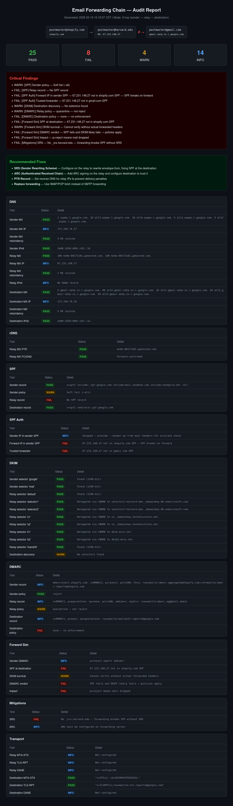

# mail-chain-audit

Generic email forwarding chain diagnostic and audit tool. Tests DNS, SPF, DKIM, DMARC, reverse DNS, SMTP connectivity, TLS, SRS/ARC mitigations, and MTA-STS/DANE across a 2-hop or 3-hop email delivery chain.



## How It Works

This tool is **passive** — it does not send any emails. All analysis is based on DNS record inspection and RFC-compliant logic:

1. **Reads DNS records** (MX, SPF, DKIM, DMARC, PTR, MTA-STS, DANE) for each domain in the chain
2. **Expands SPF recursively** — follows `include:`, `redirect=`, resolves `a:`, `mx`, `ip4:`, `ip6:` directives (up to 10 levels per RFC 7208)
3. **Simulates authentication** — determines whether SPF/DKIM/DMARC would pass or fail when mail traverses the relay, based on which IPs are authorized by which domains
4. **Probes SMTP connectivity** — the only active network test; checks if relay and destination mail servers are reachable on ports 25/465/587

The relay → destination test answers: *"If the relay server connects to the destination MX and presents mail from the original sender, will SPF pass? Is the relay a trusted forwarder? What does the sender's DMARC policy do on failure?"* — all deterministic from DNS.

> **Note:** To verify end-to-end delivery, send a real test email through the chain and inspect the `Authentication-Results` header at the destination. This tool predicts the outcome; the header confirms it.

## Requirements

- `bash` 4+
- `dig` (dnsutils / bind-utils)
- `nc` (netcat)
- `openssl`
- `python3` (for CIDR matching in SPF checks)

## Quick Start

```bash
chmod +x mail-chain-audit.sh

# 2-hop: GitHub notifications → Gmail
./mail-chain-audit.sh --sender github.com --dest gmail.com

# 3-hop: Shopify alerts → university alumni forward → Gmail
./mail-chain-audit.sh \
  --sender shopify.com \
  --relay harvard.edu \
  --dest gmail.com \
  --dir reports/

# Fast DNS-only (skip slow SMTP/TLS probes)
./mail-chain-audit.sh --sender stripe.com --dest outlook.com --skip-smtp --skip-tls

# From config file
./mail-chain-audit.sh --config chain.conf --dir reports/
```

## Chain Modes

### 2-hop (direct delivery)

```
sender.com  ──→  dest.com
```

Tests whether the sender's DNS (SPF/DKIM/DMARC) is properly configured for direct delivery to the destination.

### 3-hop (relay/forwarding)

```
sender.com  ──→  relay.com  ──→  dest.com
```

Tests the full forwarding chain and identifies authentication breakage at the relay hop. This is the primary use case — diagnosing why forwarded email gets quarantined or rejected.

## Options

### Required

| Flag | Description |
|---|---|
| `--sender <domain>` | Sender/origin domain |
| `--dest <domain>` | Final destination domain |

### Relay (3-hop mode)

| Flag | Description |
|---|---|
| `--relay <domain>` | Intermediate relay domain |
| `--relay-mx-ip <ip>` | Relay MX gateway IP (auto-resolved if omitted) |
| `--relay-backend-ip <ip>` | Backend mailbox server IP, if different from MX |
| `--relay-recipient <addr>` | Relay recipient address |

### Sender/Destination

| Flag | Description |
|---|---|
| `--sender-email <addr>` | Full sender email (default: `postmaster@<sender>`) |
| `--sender-ip <ip>` | Known sender outbound IP from mail headers (see note below) |
| `--dest-recipient <addr>` | Destination recipient address |

> **Note on `--sender-ip`:** MX records are for *receiving* mail, not sending. The script does **not** auto-resolve sender IP from MX to avoid false positives. Provide the actual outbound sending IP from email headers (`Received:` lines) for accurate SPF authorization checks. If omitted, the sender SPF authorization test is skipped with an informational note.

### Output

| Flag | Description |
|---|---|
| `--html <file>` | Write HTML report |
| `--json <file>` | Write JSON report |
| `--dir <directory>` | Write all reports (auto-named with timestamp) |
| `--no-color` | Disable colored terminal output |

### Tuning

| Flag | Description |
|---|---|
| `--smtp-timeout <secs>` | SMTP probe timeout (default: 6) |
| `--dns-timeout <secs>` | DNS query timeout (default: 3) |
| `--skip-smtp` | Skip SMTP connectivity tests (faster) |
| `--skip-tls` | Skip TLS certificate tests (faster) |
| `--dkim-selectors <s1,s2>` | Extra DKIM selectors to probe (comma-separated) |
| `-v, --verbose` | Show debug-level detail |
| `--config <file>` | Load parameters from config file |

## Config File Format

```ini
# chain.conf — Example: AWS alerts forwarded through Stanford to Microsoft 365
SENDER_DOMAIN=amazon.com
SENDER_EMAIL=no-reply@amazon.com
RELAY_DOMAIN=stanford.edu
RELAY_RECIPIENT=admin@stanford.edu
DEST_DOMAIN=microsoft.com
DEST_RECIPIENT=user@microsoft.com
DKIM_SELECTORS=custom1,custom2,myprovider
```

CLI flags override config file values.

## Tests Included

### 1. DNS Resolution

Checks for each domain in the chain:
- **MX records** — existence and resolution
- **CNAME on MX** — RFC 2181 violation (MX must not be a CNAME)
- **MX redundancy** — single MX = no failover
- **IPv6 (AAAA)** — whether mail servers have IPv6 addresses

### 2. Reverse DNS (PTR Records)

For each explicitly provided IP in the chain:
- **PTR record** — missing rDNS causes mail rejection/penalization at most providers
- **Forward-confirmed rDNS (FCrDNS)** — the PTR hostname must resolve back to the same IP; mismatch is suspicious

### 3. SPF Records

For each domain:
- **SPF existence** — whether `v=spf1` TXT record is published
- **Policy strictness** — `-all` (hard fail, good), `~all` (soft fail, permissive), `?all` (neutral, no protection)

### 4. SPF Authorization — Forwarding Chain

The critical forwarding test. SPF evaluation supports `include:`, `redirect=`, `ip4:`, `ip6:`, `a:`, bare `a`, and `mx` directives with recursive expansion (up to 10 levels per RFC 7208):

- **Sender IP in sender SPF** — baseline check (only when `--sender-ip` is provided)
- **Relay forwarding IP in sender SPF** — will the forwarded mail pass SPF at the destination? (almost always fails — this is THE problem)
- **Relay IP in destination SPF** — is the relay a trusted forwarder?
- **Relay MX vs backend** — checks both IPs if they differ

### 5. DKIM Selector Discovery

Brute-forces 30+ common DKIM selectors for each domain:
- `default`, `selector1`, `selector2`, `google`, `s1`, `s2`, `k1`, `dkim`, `mail`, `smtp`, `mandrill`, `sendgrid`, `mailgun`, `postmark`, `sparkpost`, `amazonses`, `mailchimp`, etc.
- Reports delegated selectors (CNAME to provider)
- Estimates key bit length and warns if < 1024 bits
- Add custom selectors with `--dkim-selectors`

### 6. DMARC Records

For each domain:
- **DMARC existence** — `_dmarc.<domain>` TXT record
- **Policy** — `reject` (best), `quarantine` (medium), `none` (monitoring only)
- **SPF alignment** (`aspf`) — strict vs relaxed
- **DKIM alignment** (`adkim`) — strict vs relaxed
- **Subdomain policy** (`sp`)
- **Reporting** — `rua` (aggregate) and `ruf` (forensic) endpoints

### 7. DMARC Forwarding Impact Simulation (3-hop only)

Simulates what happens when the relay forwards mail:
- **SPF at destination** — will the relay's IP pass the sender's SPF?
- **DKIM survival** — will DKIM signatures survive header modification? (unknown without actual headers)
- **DMARC verdict** — combined result and which policy applies (dynamic, based on actual SPF check results)
- **Impact assessment** — `reject` = dropped, `quarantine` = spam folder, `none` = delivered but reported

### 8. Forwarding Mitigation Checks (3-hop only)

- **SRS (Sender Rewriting Scheme)** — checks for `_srs.<relay-domain>` DNS record indicating envelope-from rewriting is configured
- **ARC (Authenticated Received Chain)** — notes that ARC is server-side config (not DNS-verifiable) and whether the destination supports it
- **M365 ARC sealer** — if destination uses Microsoft 365, reminds to check trusted ARC sealer config

### 9. SMTP Connectivity

For relay and destination mail servers:
- **Port probing** — tests ports 25, 465, 587 on each IP
- **Banner capture** — reads the SMTP greeting
- **STARTTLS support** — checks EHLO capabilities
- Skippable with `--skip-smtp` for faster DNS-only audits

### 10. TLS Certificate Check

For relay servers (if SMTP is reachable):
- **Certificate subject** — what domain the cert is issued for
- **Issuer** — which CA signed it
- **Expiry date** — when it expires
- Skippable with `--skip-tls`

### 11. MTA-STS & DANE (Transport Security)

For relay and destination domains:
- **MTA-STS** — `_mta-sts.<domain>` record for mandatory TLS enforcement
- **TLS-RPT** — `_smtp._tls.<domain>` for TLS failure reporting
- **DANE/TLSA** — `_25._tcp.<mx-host>` for certificate pinning via DNSSEC

## Output Formats

### Terminal

Colored output with PASS/FAIL/WARN/INFO status for each test, findings summary, root cause analysis, and recommended fixes. Automatically disables color when piped.

### HTML Report (`--html` or `--dir`)

Dark-themed HTML report with:
- Visual chain diagram (shows break point only when forwarding failures are detected)
- Summary cards (pass/fail/warn/info counts)
- Critical findings list
- Recommended fixes (shown only when forwarding breakage is detected)
- Full results table grouped by test section
- See `examples/sample-report.html` for the raw HTML

### JSON Report (`--json` or `--dir`)

Machine-readable JSON with:
- Chain configuration
- Summary counts
- Array of all test results with section, test name, status, and detail

## Exit Codes

| Code | Meaning |
|---|---|
| 0 | Audit completed (regardless of findings) |
| 1 | Invalid arguments or missing config |

## Examples

```bash
# ── 2-hop examples (sender → destination) ──

# GitHub notifications → Gmail
./mail-chain-audit.sh --sender github.com --dest gmail.com --dir reports/

# Stripe payment receipts → Outlook.com
./mail-chain-audit.sh --sender stripe.com --dest outlook.com --skip-smtp

# LinkedIn notifications → Yahoo Mail
./mail-chain-audit.sh --sender linkedin.com --dest yahoo.com --skip-smtp --skip-tls

# Slack alerts → ProtonMail
./mail-chain-audit.sh --sender slack.com --dest protonmail.com

# ── 3-hop examples (sender → relay → destination) ──

# Shopify alerts → Harvard alumni forwarding → Gmail
./mail-chain-audit.sh \
  --sender shopify.com \
  --relay harvard.edu \
  --dest gmail.com \
  --dir reports/

# AWS notifications → Stanford relay → Microsoft 365
./mail-chain-audit.sh \
  --sender amazon.com \
  --relay stanford.edu \
  --relay-recipient admin@stanford.edu \
  --dest microsoft.com \
  --dir reports/

# Jira notifications → MIT alumni forward → Yahoo
./mail-chain-audit.sh \
  --sender atlassian.com \
  --relay mit.edu \
  --dest yahoo.com \
  --skip-smtp

# ── With known sender IP (from mail headers) ──

# DigiCert certificate alerts with known sending IP
./mail-chain-audit.sh \
  --sender geotrust.com \
  --sender-ip 34.213.233.92 \
  --relay harvard.edu \
  --dest gmail.com \
  --skip-smtp

# ── Other usage patterns ──

# Pipe to file (auto-disables color)
./mail-chain-audit.sh --sender github.com --dest gmail.com > audit.txt

# With extra DKIM selectors for niche providers
./mail-chain-audit.sh \
  --sender shopify.com --dest gmail.com \
  --dkim-selectors shopify,transactional,notifications

# From config file with HTML output
./mail-chain-audit.sh --config examples/shopify-harvard-gmail.conf --html report.html
```

## License

MIT
